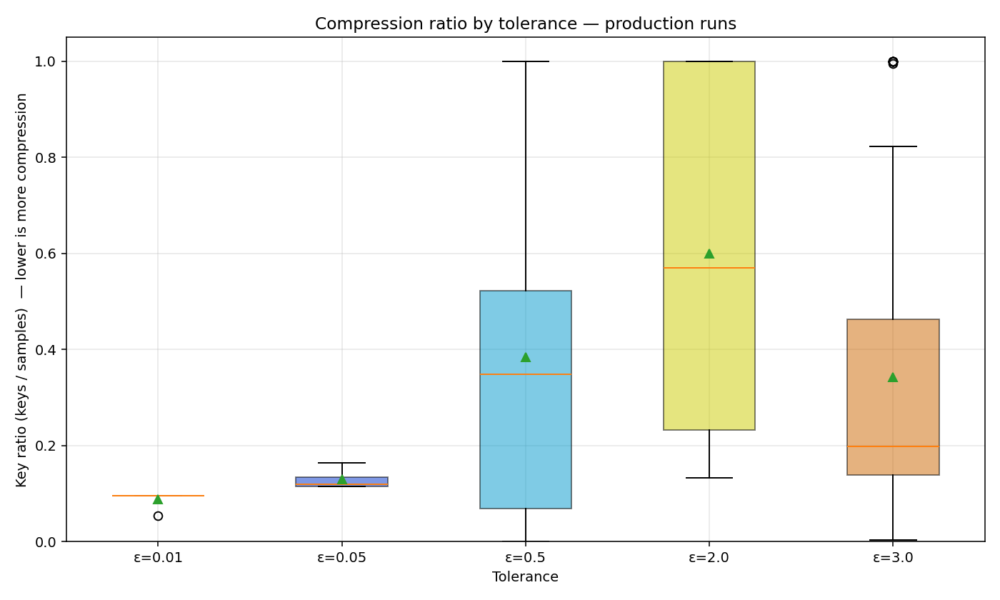
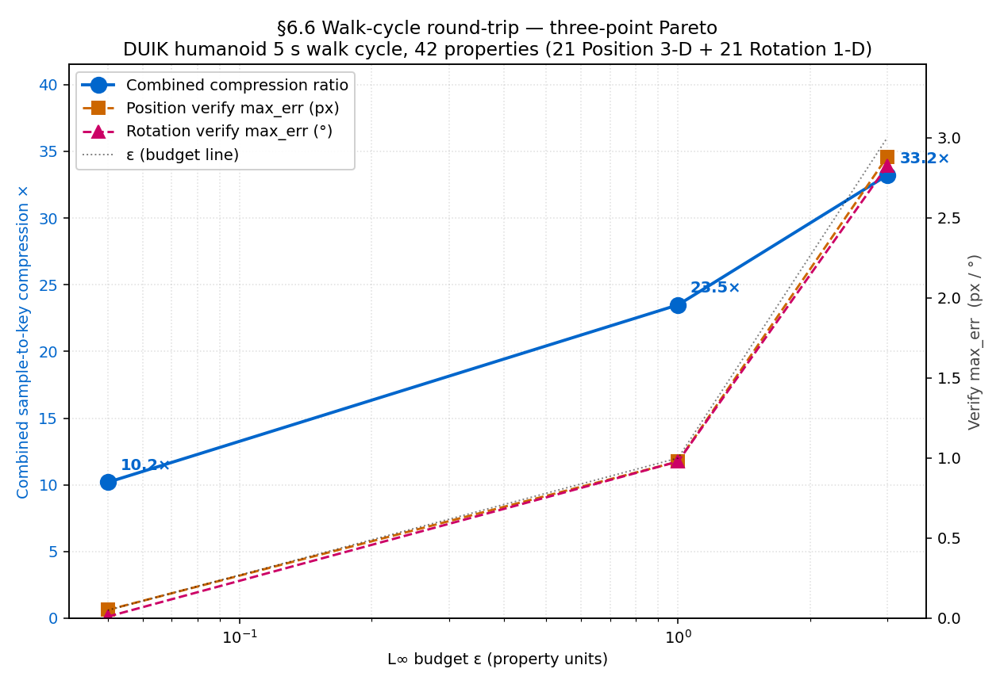
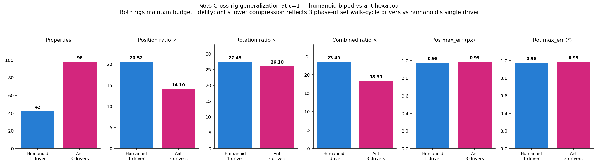
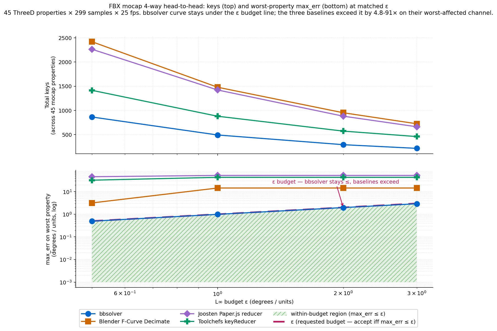
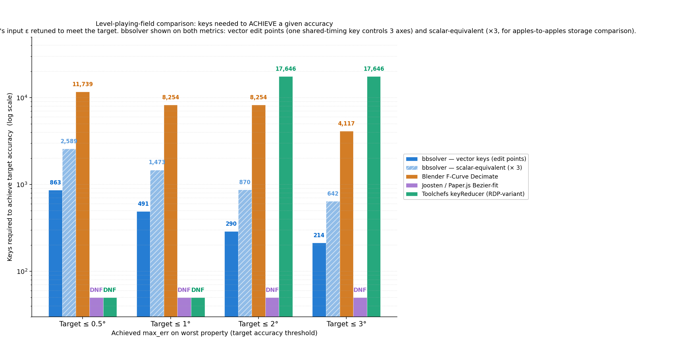
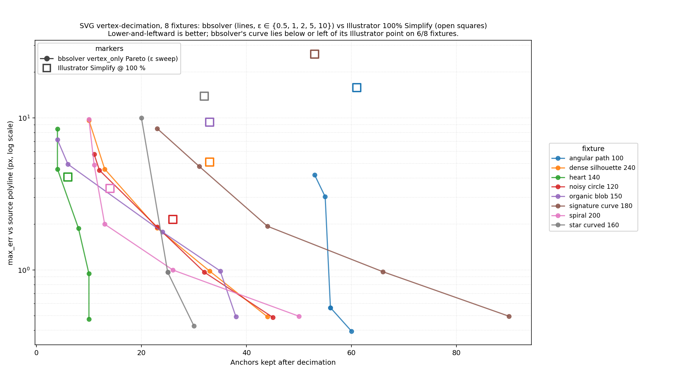
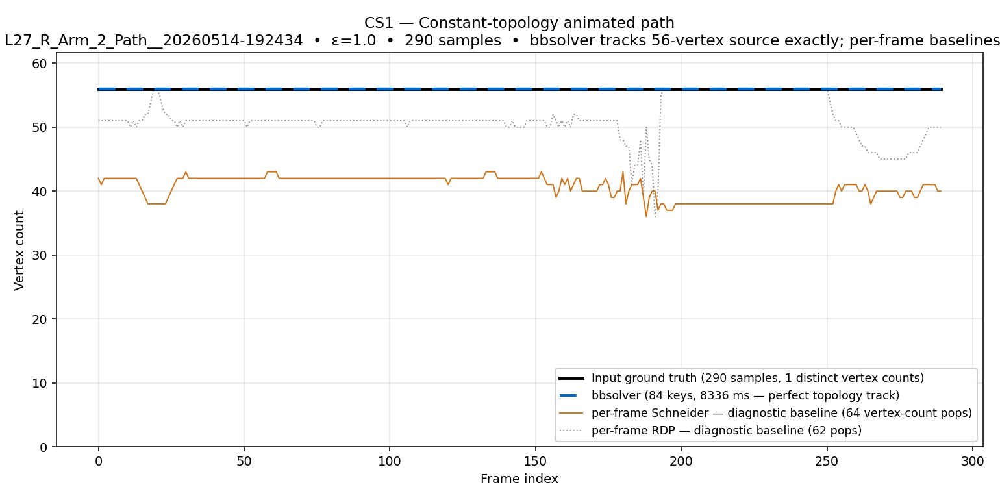
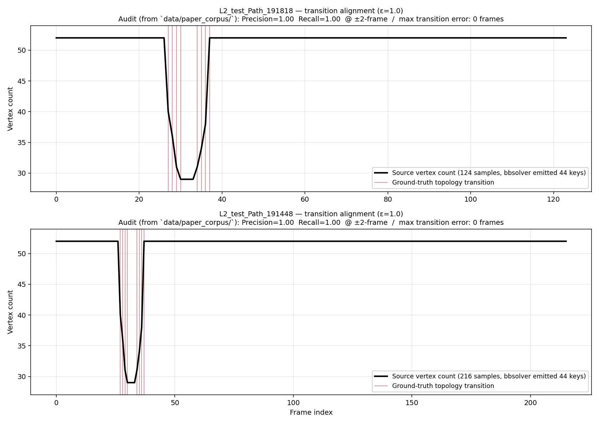
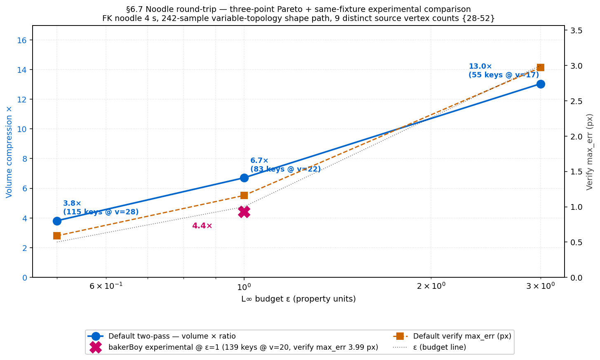
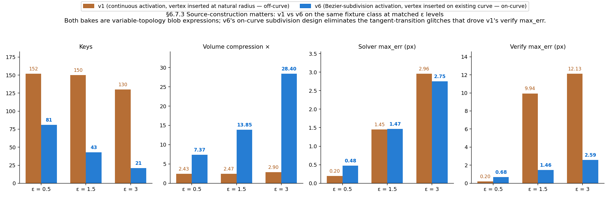

# bbsolver — benchmark highlights

A light summary of `bbsolver`'s headline benchmark results. Every
number is auditable from the public artifacts under
[`benchmarks/`](benchmarks/) and reproducible from a fresh clone with
the `bbsolver 1.0.1` binary. See
[`benchmarks/README.md`](benchmarks/README.md) for the full layout
and reproduction recipe.

`bbsolver` is a standalone C++ spatiotemporal optimization engine. It
reads dense sampled animation (mocap, expression-driven rigs,
parented transforms, generated vector paths) and emits a sparse
editable keyframe representation that stays inside an explicit
property-specific L∞ error budget. Hosts communicate with the solver
through JSON `SampleBundle` / `KeyBundle` files; After Effects and
Blender are reference adapters rather than dependencies.

## Production corpus (203 unique runs)



Aggregated from 203 unique production solves across `bbsolver 0.1.0`
development snapshots through `bbsolver 1.0.0`:

| Statistic | Value |
|---|---:|
| Total runs | 203 |
| Runs touching a path property | 123 (60.6%) |
| Median input samples / run | 430 |
| Median output keys / run | 57 |
| **Median sample-to-key reduction** | **5.51×** |
| Mean reduction (skewed by near-static properties) | 32.79× |
| Overall reduction (sum_samples / sum_keys) | **174,350 / 22,318 = 7.81×** |
| Median solve time | 824 ms |
| Maximum solve time observed | 1,096 s (path-heavy variable-topology bake) |

Raw rows ship at
[`benchmarks/supplementary/production_corpus_per_run.csv`](benchmarks/supplementary/production_corpus_per_run.csv);
the aggregate at
[`benchmarks/supplementary/production_corpus_summary.csv`](benchmarks/supplementary/production_corpus_summary.csv).

## DUIK humanoid walk-cycle (After Effects round-trip)



42 Position + Rotation properties × 12,684 dense source samples, baked
in After Effects, written back into AE, and re-sampled at the original
validation times:

| ε | Output keys | Reduction | Max position error | Max rotation error |
|---:|---:|---:|---:|---:|
| 0.05 | 1,245 | 10.2× | 0.052 px | 0.010° |
| 1.0 | 540 | **23.5×** | 0.978 px | 0.978° |
| 3.0 | 382 | 33.2× | 2.881 px | 2.825° |

## Cross-rig generalization — ant hexapod



Same protocol on a different rig topology. 98 Position + Rotation
properties × 11,956 samples → 653 keys (**18.3×**) at ε=1; max error
0.99 px / 0.99°.

## FBX mocap cross-host validation (via Blender)



45 ThreeD properties × 299 samples × 25 fps, sampled through Blender.
Comparison against Blender F-Curve Decimate plus standalone-Python
ports of [`robertjoosten/maya-keyframe-reduction`](https://github.com/robertjoosten/maya-keyframe-reduction)
and [`Toolchefs/keyReducer`](https://github.com/Toolchefs/keyReducer).

**At matched ε=1, only `bbsolver` stays inside the requested budget on
every property:**

| Method at ε=1 | Output keys (vector / scalar-eq) | Worst max error |
|---|---:|---:|
| **bbsolver** | **491 / 1,473** | **0.99** |
| Blender F-Curve Decimate | — / 1,479 | 14.44 |
| Joosten Paper.js reducer | — / 1,422 | 51.93 |
| Toolchefs keyReducer | — / 879 | 42.83 |



Retuned comparison — keys each method needs to actually reach a given
accuracy target. `bbsolver` advantage: **13.6–82.5×** on vector edit
points (shared-timing animator controls), **4.5–27.5×** on scalar
storage / insertion count (`bbsolver` vector keys counted ×3 for
apples-to-apples).

## Static SVG path simplification vs Adobe Illustrator



8 closed-polyline fixtures (100–239 source vertices each, spanning
smooth shapes, signatures, blobs, dense silhouettes, sharp-cornered
stars, spirals). At matched anchor counts:

- `angular_path_100` — Illustrator: 61 anchors / 15.79 px error · `bbsolver`: 60 / **0.40** px at ε=0.5
- `dense_silhouette_240` — Illustrator: 33 / 5.12 px · `bbsolver`: 33 / **0.98** px at ε=1
- `star_curved_160` — Illustrator: 32 / 13.84 px · `bbsolver`: 30 / **0.43** px at ε=0.5

`bbsolver` beats Illustrator on 6/8 fixtures, comparable on 2/8.
Illustrator is a practitioner baseline (its UI doesn't expose an
explicit error contract); this is practical comparison rather than a
formal dominance proof.

## Constant-topology path (CS1)



A constant-topology animated path: 290 samples × 56 vertices. At ε=1,
`bbsolver` emits 84 keys and preserves the 56-vertex topology
exactly. Per-frame baselines (Schneider, RDP) generate visually
unstable vertex-count changes because they simplify each frame
independently: 64 Schneider pops, 62 RDP pops.

## Variable-topology stress (CS2, noodle, blob)



CS2 is a diagnostic variable-topology stress case: 124 samples, 44
keys at ε=1, 2.73× volume compression. `bbsolver` detects topology
transitions with frame-perfect precision / recall at ±1-frame.



The FK noodle fixture is a production-style variable-topology path
expression. The production solve writes AE-compatible uniform-topology
output. At ε=1: 83 keys, 6.7× volume compression, `solver_max_err =
0.974` px / `ae_roundtrip_max_err = 1.160` px.



The blob lineage shows source-design sensitivity: v1 (continuous
off-curve activation) generates many topology transitions and large
AE-side gaps at loose budgets; v6 (subdivision on-curve formulation)
produces cleaner topology changes and much tighter round-trip
behaviour. At ε=1.5, v6 emits 43 keys, 13.85× volume compression,
`ae_roundtrip_max_err = 1.465` px.

## Determinism

60 invocations across 3 fixtures × {serial, multi-threaded} × 10
repetitions. Every condition produced **one unique normalized output
hash** — all 10 repetitions emitted bit-identical `bbky.json` content.

Raw rows at
[`benchmarks/supplementary/determinism_audit.csv`](benchmarks/supplementary/determinism_audit.csv).

## Reproducing

Every number above is auditable from public artifacts in this
repository, and regenerable where the required inputs are available:

- **Solver-only rows** (in-loop `max_err`, key counts, canonical CLI
  verify) regenerate from the public `bbsm` / `bbky` corpus under
  `benchmarks/corpus/`. No external dependencies beyond the
  `bbsolver` binary.
- **AE round-trip rows** additionally require an After Effects 2024+
  licence. The AE project lives at
  `benchmarks/after_effects_benchmark_project/`. The `bbsm` bundles
  capture the sampled host state at solve time — they drive the
  AE-independent solver-only path.
- **Static SVG rows** additionally require Adobe Illustrator (or any
  tool that produces equivalent simplification output).
- **Production-corpus aggregate** is publicly auditable from the
  shipped per-run + summary CSVs. Full regeneration from the raw
  203-run `live_runs/` folders requires the private original
  development corpora and is not redistributed.

The recommended `bbsolver` binary for reproduction is **v1.0.1**:

```sh
gh release download v1.0.1 --repo ivg-design/bbsolver \
    --pattern 'bbsolver-v1.0.1-macos-arm64.tar.gz' --pattern 'SHA256SUMS.txt'
shasum -a 256 -c SHA256SUMS.txt --ignore-missing
tar -xzf bbsolver-v1.0.1-macos-arm64.tar.gz
./bbsolver-v1.0.1-macos-arm64/bin/bbsolver --version
# bbsolver 1.0.1
```

Or build from source: `cmake -S . -B build -DCMAKE_BUILD_TYPE=Release && cmake --build build -j`.
